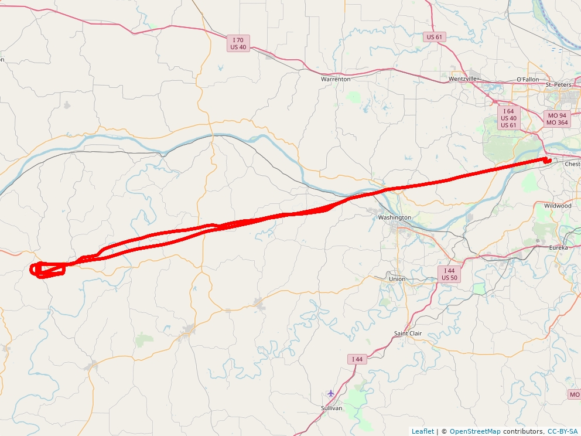
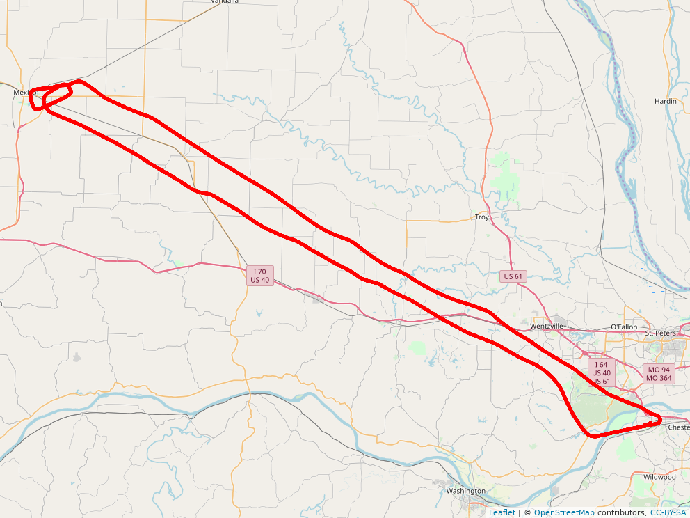
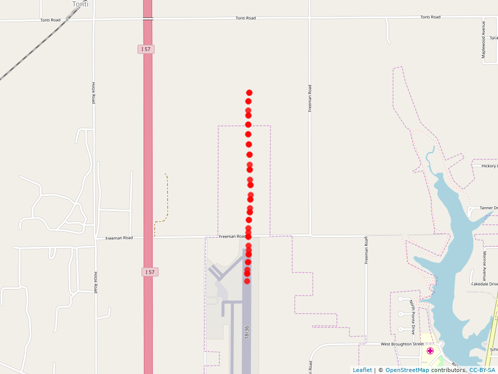
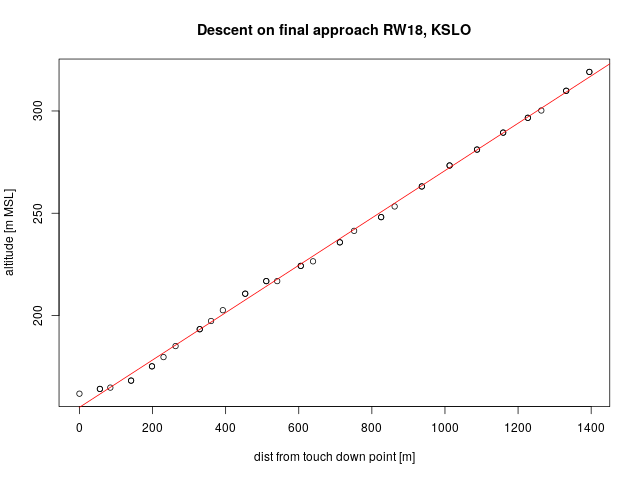

## Flight Trajectory Analysis   
[Andreas Windisch](https://www.linkedin.com/in/andreas-windisch-physics/)
   
### 0 Synopsis   
In this repository, I collect and analyze some of the data that I recorded from the sensors of my cell phone when plioting general aviation aircraft. Apart from position (WGS84), I also recorded altitude, magnetic heading, ground speed, and data from the accelerometers.
Feel free to use the data as you please. You can contact me using andreas.windisch@yahoo.com. You can also find and connect with me on [LinkedIn](https://www.linkedin.com/in/andreas-windisch-physics/).

### 1 Files in this repository   

#### C152_N53398_KCPS_to_KSLO_2017-10-29.csv     
This file contains data recorded on October 29 2017 when flying a Cessna 152 (N53398) from St. Louis Downtown Airport (KCPS) to Salem Leckrone airport (KSLO). The data covers only the trip to KSLO, as well as a touch-and-go maneuver executed at KSLO. The recording ends shortly after the climb-out after the touch-and-go. I started the trip with full tanks and had no passenger on this flight. The flight was uneventful. The sample rate of the recording is 1 Hz. Here is an open streetmap image of the flight, produced by the R-script I provide in this repository. The plot has been created with the R-package leaflet.    

#### DA20-C1_N107TX_KSUS_to_1H3_2018-07-17.csv   
This file contains data recorded on July 17 2018 when flying a Diamond Aircraft DA-20 C1 Eclipse (N107TX) from Spirit of St. Louis Airport (KSUS) to State Technical College of Missouri Airport (1H3). The data covers both, the trip to 1H3 and back to KSUS. I started out with full tanks, and I was the only occupant of the plane. When closing in on 1H3 I had to choose a lower altitude because of the ceilings becoming lower to the west. At 1H3, I executed 2 go-around maneuvers and one touch-and-go. After that, I flew straight back to KSUS. Here is the map of the recorded flight.   

#### DA20-C1_N107TX_KSUS_to_KMYJ_2018-09-15.csv 
This file contains data recorded on September 15 2018 when flying a Diamond Aircraft DA-20 C1 Eclipse (N107TX) from Spirit of St. Louis Airport (KSUS) to Mexico Memorial Airport (KMYJ). I started out at KSUS with full tanks and I was the sole occupant of the aircraft. The flight was uneventful. I executed a touch-and-go maneuver at KMYJ and flew straight back to KSUS. Here is the map of the full recording. 

#### README.md   
This file.   
   

#### trajectories.R   
This R-script contains the sources used to produce the plots. I wrote comments where appropriate. If you have any questions, just write me an email using the address provided above.   
   
#### \*.png
Those files have been produced by the R-script trajectories.R. They contain Open Streetmap images and other plots produced in the course of the analysis

### 2 A closer look at flight number 1 (KCPS to KSLO)
One interesting aspect to look into is, for example, the quality of the descent for the touch-and-go maneuver. I therefore isolated the data that corresponds to the final approach for Runway 18 at KSLO and clipped it off at touch-down, where I determined this point by eyeballing the altitude data. Here are the data points in question, displayed on Open Streetmap.   

When flying a stabilized approach, one should try to establish a constant descent rate throughout the approach, so, under ideal conditions, this would amount to a linear function (up to the point of flare). Here is a plot of the altitude profile of the short final approach to RW 18 at KSLO in meters MSL as a function of the touch down point on the runway, also in meters.  

   

      
