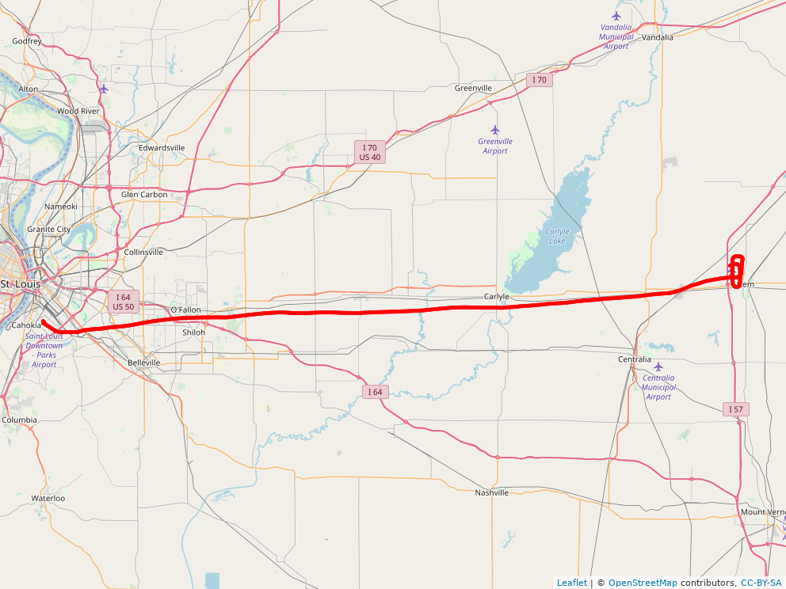

## Flight Trajectory Analysis   
[Andreas Windisch](https://www.linkedin.com/in/andreas-windisch-physics/)
   
### 0 Synopsis   
In this repository, I collect and analyze some of the data that I recorded from the sensors of my cell phone when plioting general aviation aircraft. Apart from position (WGS84), I also recorded altitude, magnetic heading, ground speed, and data from the accelerometers.
Feel free to use the data as you please. You can also find and connect with me on [LinkedIn](https://www.linkedin.com/in/andreas-windisch-physics/)).

### 1 Data Files in this repository   

-- C152_N53398_KCPS_to_KSLO_2017-10-29.csv     
This file contains data recorded on October 29 2017 when flying a Cessna 152 (N53398) from St. Louis Downtown airport (KCPS) to Salem Leckrone airport (KSLO). The data covers only the trip to KSLO, not the trip back. The sample rate of the recording is 1 Hz.    

-- DA20-C1_N107TX_KSUS_to_1H3_2018-07-17.csv   
-- DA20-C1_N107TX_KSUS_to_KMYJ_2018-09-15.csv   

      
