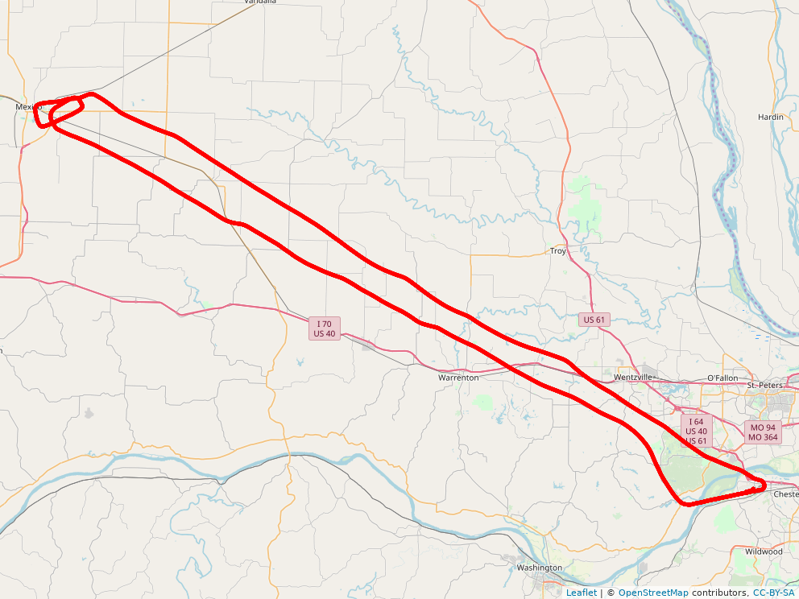
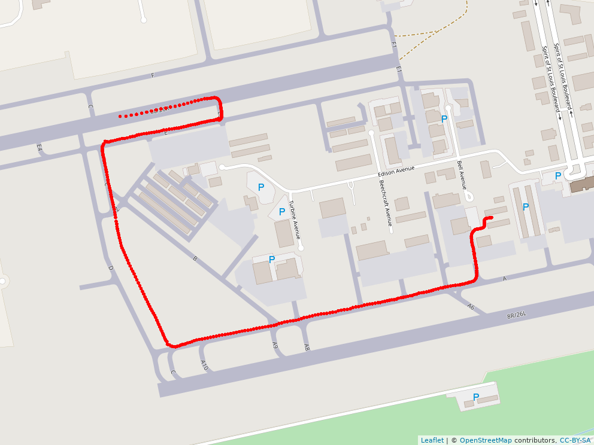

## Flight Trajectory Analysis   
[Andreas Windisch](https://www.linkedin.com/in/andreas-windisch-physics/)
   
### 0 Synopsis   
In this repository, I collect and analyze some of the data that I recorded from the sensors of my cell phone when plioting general aviation aircraft. Apart from position (WGS84), I also recorded altitude, magnetic heading, ground speed, and data from the accelerometers.
Feel free to use the data as you please. You can contact me using andreas.windisch@yahoo.com. You can also find and connect with me on [LinkedIn](https://www.linkedin.com/in/andreas-windisch-physics/).

### 1 Files in this repository   

#### C152_N53398_KCPS_to_KSLO_2017-10-29.csv     
This file contains data recorded on October 29 2017 when flying a Cessna 152 (N53398) from St. Louis Downtown Airport (KCPS) to Salem Leckrone airport (KSLO). The data covers only the trip to KSLO, as well as a touch-and-go maneuver executed at KSLO. The recording ends shortly after the climb-out after the touch-and-go. I started the trip with full tanks and had no passenger on this flight. The flight was uneventful. The sample rate of the recording is 1 Hz. Here is an open streetmap image of the flight, produced by the R-script I provide in this repository. The plot has been created with the R-package leaflet.    

#### DA20-C1_N107TX_KSUS_to_1H3_2018-07-17.csv   
This file contains data recorded on July 17 2018 when flying a Diamond Aircraft DA-20 C1 Eclipse (N107TX) from Spirit of St. Louis Airport (KSUS) to State Technical College of Missouri Airport (1H3). The data covers both, the trip to 1H3 and back to KSUS. Note that on this flight, I turned on the recording a short while after departure from KSUS, so taxiing and takeoff at KSUS is not included. However, taxiing after landing is available. I started out with full tanks, and I was the only occupant of the plane. When closing in on 1H3 I had to choose a lower altitude because of the ceilings becoming lower to the west. At 1H3, I executed 2 go-around maneuvers and one touch-and-go. After that, I flew straight back to KSUS. Here is the map of the recorded flight.   

#### DA20-C1_N107TX_KSUS_to_KMYJ_2018-09-15.csv 
This file contains data recorded on September 15 2018 when flying a Diamond Aircraft DA-20 C1 Eclipse (N107TX) from Spirit of St. Louis Airport (KSUS) to Mexico Memorial Airport (KMYJ). I started out at KSUS with full tanks and I was the sole occupant of the aircraft. The flight was uneventful. I executed a touch-and-go maneuver at KMYJ and flew straight back to KSUS. Here is the map of the full recording. 
   

#### DA20-C1_N107TX_KSUS_to_KFYG_2018_10_15.csv   
This file contains data recorded on October 15 2018 when I took a biennial flight review with Hans Brosbol. The aircraft was a DA-20 C1 Eclipse. The flight consisted of a normal takeoff and climb out at KSUS (RW 26L), followed by slow flight, a power-off stall, two power-on stalls, steep turns, a simulated engine failure and power-off landing at Washington Regional Airport (KFYG), a no-flap landing at KFYG, and finally a normal landing at KSUS, again using 26L. It was a stunningly calm day, and for the second half of the flight the sun was already below the horizon. Thank you, Hans, for this amazing flight!
   

#### DA20-C1_N107TX_KSUS_sightseeing_2018_10_17.csv   
This file contains data recorded on October 17 2018 when taking a short sightseeing flight with a passenger in a DA-20 C1 Eclipse. The flight consisted of a normal takeoff and climb out at KSUS (RW 26L). The flight was uneventful and took us up north to the Winfield Dam, above which I turned back to the south west with intention of flying down to Washington Regional Airport. However, the air was so bumpy, that the ride wasn't very enjoyable, so I decided to head back to KSUS. On final for 26L, the tower reported wind variable at 4 kts with gusts 18 kts. The latter figure increased throughout my approach, and the landing wasn't pretty (but safe). 
   
 

#### README.md   
This file.   
   

#### trajectories.R   
This R-script contains the sources used to produce the plots. I wrote comments where appropriate. If you have any questions, just write me an email using the address provided above.   
   
#### \*.png
Those files have been produced by the R-script trajectories.R. They contain Open Streetmap images and other plots produced in the course of the analysis

### 2 Final approach to KSLO (flight 1)
One interesting aspect to look into is, for example, the quality of the descent for the touch-and-go maneuver. I therefore isolated the data that corresponds to the final approach for Runway 18 at KSLO and clipped it off at touch-down, where I determined this point by eyeballing the altitude data. Here are the data points in question, displayed on Open Streetmap.   

When flying a stabilized approach, one should try to establish a constant descent rate throughout the approach, so, under ideal conditions, this would amount to a linear function (up to the point of flare). Here is a plot of the altitude profile of the short final approach to RW 18 at KSLO in meters MSL as a function of distance to the touch down point on the runway, also in meters.  

   
### 3 Taxiing after arriving at KSUS (flight 2)
Open Streetmap does an amazing job in providing detailed maps. Even the taxiway designations are correctly included, which allows you to extract the exact route you took when taxiing in or out. Here is an example of the taxi route after the landing at KSUS (Runway 8L) to the FBO Million Air, located just opposite of TW A6. Here is the map.

      
### 4 How far down the runway did I touch down? (flight 1)
As a pilot, I am also interested in where the touch-down point on the runway is, since it tells me how much of the runway I did not use and how much I have left. From the data extracted in Section 2, we can simply compute the distance between the touch-down point and the beginning of the runway. The geo position of the latter can be extracted with just one click using Google Maps or OpenStreetMaps. For the landing under consideration, RW18 at KSLO, it turns out the the northern edge of the runway is at lat 38.648504, lon -88.964145. 
In this case, the point of touchdown is around 246 meters down the runway. For details, have a look at the R-script trajectories.R.
   
### 5 How good was the alignment with RW18 throughout the approach? (flight 1)
By looking at the recorded variable 'locationcourse' we can extract the distribution (spread) of the course on final approach, where I am again considering the landing discussed in Section 2. Here is a density plot that shows the distribution.   
   
The distribution has a stronger tail on the right, which is probably because I turned to final from the west. This would explain the presence of values larger than 180 if I included some portion of the flight path where the turn to final was not over yet. The overall spread of the bigger peak indicates a fairly small variation throughout the approach. Cross wind should not affect the measurement. Note that I haven't accounted for any errors of the cell phone's sensors here. 
   
### 6 Steep Turns (flight 4)) 
Here is the trajectory of my steep turns. I started out with a turn to the left, and after completing the 360 I rolled into a right turn for another 360.    
   

   
     
         

     

      
